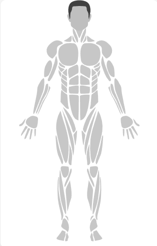
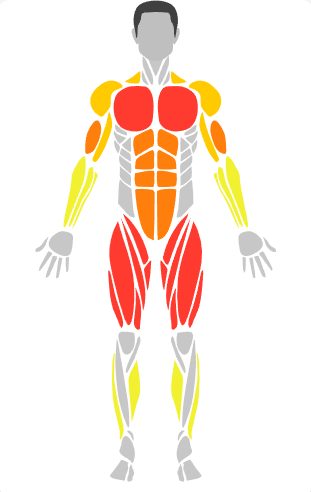
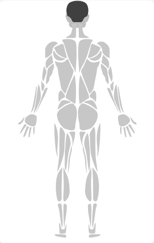
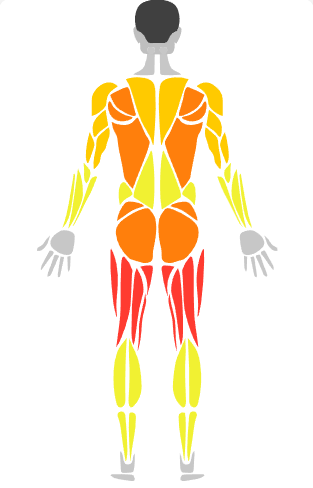
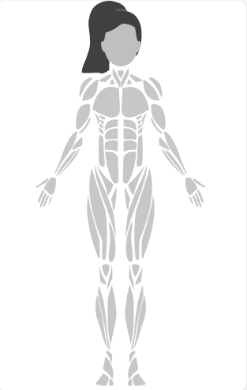
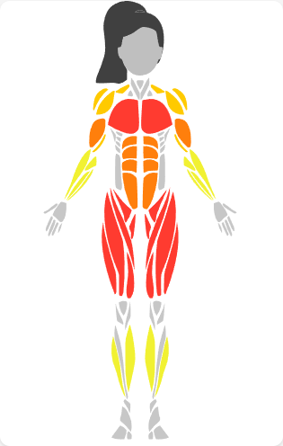
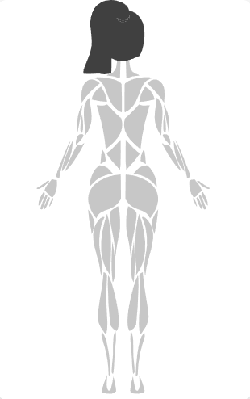
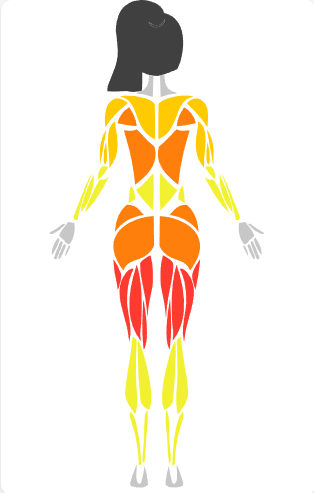

# 💪 MuscleMap — React Native

An interactive human body muscle map component for React Native. Tap muscles, highlight groups, and visualize workout intensity with heatmaps.

> **React Native port of [MuscleMap](https://github.com/melihcolpan/MuscleMap) by [@melihcolpan](https://github.com/melihcolpan) — original Swift/SwiftUI library.**

---

## ✨ Features

- 🧍 Male & Female body models (front + back)
- 🎯 Tap-to-select individual muscles
- 🌡️ Heatmap mode with customizable color scales
- 🎨 4 built-in style presets (default, minimal, neon, medical)
- 🔍 36 muscle groups with sub-group support
- 📐 SVG-based — scales perfectly on any screen size
- 🟦 Full TypeScript support

---

## 📸 Preview

### Male
| Front — Default | Front — Heatmap | Back — Default | Back — Heatmap |
|----------------|----------------|---------------|---------------|
|  |  |  |  |

### Female
| Front — Default | Front — Heatmap | Back — Default | Back — Heatmap |
|----------------|----------------|---------------|---------------|
|  |  |  |  |

---

## 📦 Installation

**1. Copy the `musclemap/` folder into your project.**

**2. Install the peer dependency:**

```bash
npx expo install react-native-svg
# or
npm install react-native-svg
```

> If you're using bare React Native (not Expo), also run:
> ```bash
> cd ios && pod install
> ```

---

## 🚀 Quick Start

```tsx
import { BodyView } from './musclemap';

export default function App() {
  return (
    <BodyView
      gender="male"
      side="front"
      onMusclePress={(muscle) => console.log(muscle)}
      style={{ flex: 1 }}
    />
  );
}
```

---

## 📖 API Reference

### `<BodyView>`

| Prop | Type | Default | Description |
|------|------|---------|-------------|
| `gender` | `'male' \| 'female'` | `'male'` | Body model gender |
| `side` | `'front' \| 'back'` | `'front'` | Front or back view |
| `highlights` | `MuscleHighlight[]` | `[]` | Manually colored muscles |
| `intensities` | `MuscleIntensity[]` | `undefined` | Intensity-based heatmap data |
| `heatmapConfig` | `HeatmapConfig` | `undefined` | Heatmap color scale config |
| `selected` | `Muscle[]` | `[]` | Currently selected muscles |
| `onMusclePress` | `(muscle: Muscle) => void` | `undefined` | Tap callback |
| `onMuscleLongPress` | `(muscle: Muscle) => void` | `undefined` | Long press callback |
| `bodyStyle` | `BodyViewStyle \| BodyStylePreset` | `'default'` | Visual style |
| `showSubGroups` | `boolean` | `false` | Show muscle sub-groups |
| `width` | `number` | `'100%'` | SVG width |
| `height` | `number` | `'100%'` | SVG height |
| `style` | `ViewStyle` | `undefined` | Container style |

---

## 🎯 Highlight Muscles

Manually color specific muscles:

```tsx
import { BodyView, MuscleHighlight } from './musclemap';

const highlights: MuscleHighlight[] = [
  { muscle: 'chest', fill: { type: 'color', color: '#FF3B30' }, opacity: 1 },
  { muscle: 'biceps', fill: { type: 'color', color: '#FF9500' }, opacity: 0.8 },
  { muscle: 'abs', fill: { type: 'color', color: '#FFFF00' }, opacity: 0.6 },
];

<BodyView gender="male" side="front" highlights={highlights} />
```

---

## 🌡️ Heatmap Mode

Visualize workout intensity (0–4 scale):

```tsx
import { BodyView, intensityMapToHighlights } from './musclemap';

const workoutData = {
  chest: 4,       // very high
  biceps: 3,      // high
  triceps: 2,     // medium
  deltoids: 1,    // low
};

const highlights = intensityMapToHighlights(workoutData);

<BodyView gender="male" side="front" highlights={highlights} />
```

### Custom color scale:

```tsx
import { BodyView, HeatmapConfig, workoutScale, thermalScale } from './musclemap';

const config: HeatmapConfig = {
  colorScale: thermalScale, // 'workoutScale' | 'thermalScale' | 'medicalScale' | 'monochromeScale'
  gradientFill: true,
  gradientDirection: 'topToBottom',
};

<BodyView
  intensities={[
    { muscle: 'chest', intensity: 0.9 },
    { muscle: 'quadriceps', intensity: 0.7 },
  ]}
  heatmapConfig={config}
/>
```

---

## 🎨 Style Presets

```tsx
// Built-in presets
<BodyView bodyStyle="default"  />  // Gray fill, green selection
<BodyView bodyStyle="minimal"  />  // Light fill with thin strokes
<BodyView bodyStyle="neon"     />  // Dark background, cyan glow
<BodyView bodyStyle="medical"  />  // Clinical blue-gray tones
```

Or provide a fully custom style:

```tsx
import { BodyViewStyle } from './musclemap';

const myStyle: BodyViewStyle = {
  defaultFillColor: '#1a1a2e',
  strokeColor: '#e94560',
  strokeWidth: 0.5,
  selectionColor: '#e94560',
  selectionStrokeColor: '#e94560',
  selectionStrokeWidth: 2,
  headColor: '#16213e',
  hairColor: '#0f3460',
};

<BodyView bodyStyle={myStyle} />
```

---

## 💪 Available Muscles

<details>
<summary>View all 36 muscle groups</summary>

| Muscle ID | Display Name |
|-----------|-------------|
| `abs` | Abs |
| `biceps` | Biceps |
| `calves` | Calves |
| `chest` | Chest |
| `deltoids` | Deltoids |
| `feet` | Feet |
| `forearm` | Forearm |
| `gluteal` | Glutes |
| `hamstring` | Hamstrings |
| `hands` | Hands |
| `head` | Head |
| `knees` | Knees |
| `lower-back` | Lower Back |
| `obliques` | Obliques |
| `quadriceps` | Quadriceps |
| `rotator-cuff` | Rotator Cuff |
| `serratus` | Serratus |
| `rhomboids` | Rhomboids |
| `tibialis` | Tibialis |
| `trapezius` | Trapezius |
| `triceps` | Triceps |
| `upper-back` | Upper Back |
| `ankles` | Ankles |
| `adductors` | Adductors |
| `neck` | Neck |
| `hip-flexors` | Hip Flexors |
| `upper-chest` | Upper Chest |
| `lower-chest` | Lower Chest |
| `inner-quad` | Inner Quad |
| `outer-quad` | Outer Quad |
| `upper-abs` | Upper Abs |
| `lower-abs` | Lower Abs |
| `front-deltoid` | Front Deltoid |
| `rear-deltoid` | Rear Deltoid |
| `upper-trapezius` | Upper Trapezius |
| `lower-trapezius` | Lower Trapezius |

</details>

---

## 🗂️ Project Structure

```
musclemap/
├── BodyView.tsx              # Main component
├── types.ts                  # TypeScript types
├── styles.ts                 # Style presets
├── heatmap.ts                # Color scale utilities
├── index.ts                  # Public exports
└── paths/
    ├── bodyPathProvider.ts   # ViewBox & path resolver
    ├── maleFrontPaths.ts     # Male front SVG paths
    ├── maleBackPaths.ts      # Male back SVG paths
    ├── femaleFrontPaths.ts   # Female front SVG paths
    └── femaleBackPaths.ts    # Female back SVG paths
```

---

## 📄 License

MIT License

---

## 🙏 Credits

This project is a React Native port of **[MuscleMap](https://github.com/melihcolpan/MuscleMap)** — a SwiftUI muscle map library by [Melih Colpan](https://github.com/melihcolpan).

All SVG path data and muscle group definitions are derived from the original Swift library.
